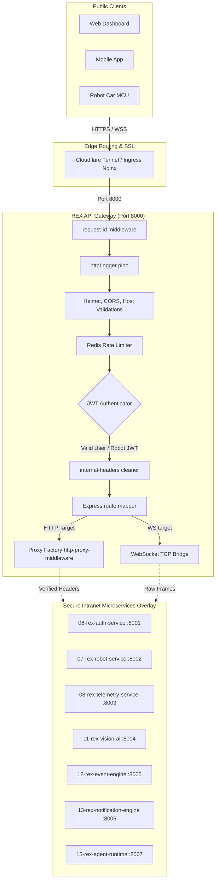

# 🚪 REX-47 Secure API Gateway (v1.0.0)

> **Repository `05`** · Production-ready, high-throughput secure API gateway and reverse proxy serving as the single public entry point for the REX-47 robot platform. Built with Express 5, TypeScript, and Redis, it handles centralized JWT credential validation, client header scrubbing, request rate limiting, Prometheus metrics tracking, and low-latency HTTP/WebSocket reverse proxy routing.

[]()
[]()
[]()
[]()
[]()

---

## 🧭 System Architecture

The API gateway manages request ingress, validating authentication claims and applying protection middleware before forwarding the proxy requests to internal overlay services.



---

## 📦 Project Structure

```
05-rex-api-gateway/
├── config/                   # Development, testing, and production config files
├── src/
│   ├── config/               # Centralized configuration mapping
│   │   ├── env.ts            # Environment variables Zod validation schemas
│   │   ├── logger.ts         # Pino logger configuration
│   │   ├── redis.ts          # IORedis connection client setup
│   │   └── services.ts       # Downstream microservices URL mappings
│   ├── middleware/           # Security, authentication, and filter shields
│   │   ├── request-id.middleware.ts       # Request UUID trace tagging
│   │   ├── security.middleware.ts         # Helmet headers, CORS origins, and host checks
│   │   ├── request-size.middleware.ts     # Payload size limits preventing resource exhaustion
│   │   ├── rate-limit.middleware.ts       # Redis-backed distributed rate limit counters
│   │   ├── user-auth.middleware.ts        # Validates and parses user JWT tokens
│   │   ├── robot-auth.middleware.ts       # Validates and parses robot device JWT tokens
│   │   ├── internal-headers.middleware.ts # Scrubs client headers & injects verified credentials
│   │   ├── not-found.middleware.ts        # 404 handler
│   │   └── error.middleware.ts            # Global HTTP error logger and response sanitization
│   ├── proxies/              # Generic and dedicated proxy forwarding factories
│   │   ├── proxy.factory.ts               # HTTP reverse proxy factory
│   │   ├── websocket.proxy.ts             # Low-latency WebSocket connection TCP bridging
│   │   └── [service].proxy.ts             # Target service-specific proxy definitions
│   ├── routes/               # Express routing endpoints
│   │   ├── health.routes.ts               # Local health, downstream ready checks, and metrics
│   │   └── [service].routes.ts            # Routing routes targeting services
│   ├── schemas/              # Zod validation schemas for request parameters
│   ├── services/             # Caching and Redis database services
│   ├── types/                # Custom TypeScript type definitions
│   ├── utils/                # Prometheus metrics recorders & helpers
│   ├── app.ts                # Express application configuration
│   └── server.ts             # Gateway startup script (TCP listener)
├── tests/                    # Vitest unit and integration supertest suites
├── tsconfig.json             # TypeScript compiler rules
├── vitest.config.ts          # Vitest execution rules & coverage parameters
├── Dockerfile                # Production multi-stage container configuration
├── docker-compose.yml        # Development environment compose file
├── Makefile                  # Build, test, lint, and run shortcuts
├── Jenkinsfile               # CI/CD automation pipeline configuration
└── README.md                 # This file
```

---

## 📡 Microservices & Routing Configuration

Downstream microservices are mapped to relative target endpoints in the routing layout defined in [services.ts](src/config/services.ts):

| Service Domain | Base Path Prefix | Target Microservice | Configuration Key |
|---|---|---|---|
| **Authentication** | `/api/v1/auth` | `06-rex-auth-service` | `AUTH_SERVICE_URL` |
| **Robots & Actuators** | `/api/v1/robots` | `07-rex-robot-service` | `ROBOT_SERVICE_URL` |
| **Telemetry Data** | `/api/v1/telemetry` | `08-rex-telemetry-service`| `TELEMETRY_SERVICE_URL` |
| **Computer Vision** | `/api/v1/vision` | `11-rex-vision-ai` | `VISION_SERVICE_URL` |
| **Event Engine** | `/api/v1/events` | `12-rex-event-engine` | `EVENT_SERVICE_URL` |
| **Notifications** | `/api/v1/notifications`| `13-rex-notification-engine`| `NOTIFICATION_SERVICE_URL`|
| **AI Agent Logic** | `/api/v1/agent` | `15-rex-agent-runtime` | `AGENT_SERVICE_URL` |

---

## 🛡️ Gateway Security & Middleware Stack

### 1. Spoofing Prevention & Header Scrubbing
To prevent malicious requests from bypassing auth checks by spoofing header values (e.g., trying to supply an artificial user ID), the [internal-headers.middleware.ts](src/middleware/internal-headers.middleware.ts) strips all incoming client headers matching the following:
* `X-User-Id` | `X-Session-Id` | `X-Robot-Id` | `X-Email-Verified` | `X-Internal-Service-Token` | `X-Gateway-Name` | `X-Request-Id`

Once authentication checks are passed, the gateway injects secure internal headers:
* `X-Internal-Service-Token`: Verified downstream signature.
* `X-Gateway-Name`: `rex-api-gateway`
* `X-Request-Id`: Request trace UUID.
* `X-User-Id` / `X-Robot-Id`: The user/device identifier extracted from the validated JWT token.

### 2. Centralized JWT Validations
* **User Authentication**: [user-auth.middleware.ts](src/middleware/user-auth.middleware.ts) validates symmetric HS256 signatures generated by the auth service. Enforces signature validation, expiration, and `email_verified: true`.
* **Robot Authentication**: [robot-auth.middleware.ts](src/middleware/robot-auth.middleware.ts) validates robot device tokens signed with `ROBOT_JWT_SECRET_KEY` containing `token_type: 'robot'`.

### 3. Distributed Redis Rate Limiting
Configured in [rate-limit.middleware.ts](src/middleware/rate-limit.middleware.ts) using `rate-limiter-flexible`, storing data in Redis to prevent memory leaks and coordinate rate limits across multiple gateway replicas:
* **Registrations**: Max 5 requests per 15 minutes per IP.
* **Logins**: Max 10 requests per 5 minutes per IP.
* **Emergency Stop**: Runs under a separate limiter key to guarantee E-Stop commands can bypass standard limits during a denial-of-service event.

---

## 🔌 WebSocket Proxy Connection Flow

WebSockets are proxied to downstream handlers (like the robot control websocket) inside [websocket.proxy.ts](src/proxies/websocket.proxy.ts):

1. **Upgrade Intercept**: The HTTP server catches TCP `upgrade` requests targeting WS endpoints.
2. **Access Check**: Evaluates user/robot JWT tokens passed in the `Authorization` header or query parameters (`?token=...`).
3. **Header Scrub**: Removes HTTP hop-by-hop headers to prevent connection conflicts.
4. **Target Tunneling**: Establishes a raw TCP proxy channel connection to the downstream microservice.
5. **Buffer Queue**: If the client sends frames while the downstream connection is in `CONNECTING` status, packets are buffered in a queue and flushed once the downstream socket status transitions to `OPEN`.
6. **Limit Protections**: Limits WS frame sizes to 64KB, and rate-limits client frames (max 30 msgs/sec for joysticks, 20 msgs/sec for arm control) to prevent buffer overflows on ESP32 controllers.

---

## 📊 Observability & Prometheus Metrics

### Health Monitoring Endpoints
* **GET `/health/live`**: Fast 200 HTTP code confirming the gateway is running.
* **GET `/health/ready`**: Verifies local Redis connections and downstream microservices.
* **GET `/health/services`**: Calls downstream health endpoints and returns detailed latency logs.

### Prometheus Analytics (`/metrics`)
The metrics endpoint exports raw parameters for Prometheus scrapers:
* `rex_gateway_http_requests_total`: Counter tracking total incoming requests partitioned by method, route, and status code.
* `rex_gateway_http_request_duration_seconds`: Histogram measuring response latencies.
* `rex_gateway_websocket_connections`: Gauge tracking active WebSocket connections.

---

## 🚀 Getting Started

### Prerequisites
* **Node.js**: `v20` or higher
* **Redis**: `v6` or higher (running locally or accessible via network)

### Local Configuration Setup
1. **Clone the repository**
   ```bash
   git clone https://github.com/thathsarabandara/05-rex-api-gateway.git
   cd 05-rex-api-gateway
   ```

2. **Install Node packages**
   ```bash
   npm ci
   ```

3. **Establish Local Settings**
   ```bash
   cp .env.example .env
   ```
   *Edit `.env` values, matching your Redis and token secret keys.*

4. **Launch Development Watch Mode**
   ```bash
   npm run dev
   ```
   *The gateway boots up, listening on port 8000.*

### Compilation, Linting, & Testing
Using the defined `package.json` scripts:
```bash
# Compile TypeScript code to /dist
npm run build

# Run Vitest test suites
npm run test

# Run tests with code coverage analysis
npm run test:coverage

# Run ESLint checking
npm run lint

# Format code with Prettier
npm run format
```

---

## 📦 Containerization & CI/CD Pipelines

### Docker Build & Compose
To compile the gateway as a containerized image:
```bash
# Build multi-stage production container image
docker build -t rex-api-gateway .

# Spin up Gateway and Redis using docker-compose
docker compose up --build
```

### Automated CI/CD
The repository includes configuration files for both local and cloud pipelines:
* **GitHub Actions**: Configured under `.github/workflows/` to launch Redis, install packages, check linting, run unit tests, and compile the Docker image on code commits.
* **Jenkins Pipeline**: Configured in [Jenkinsfile](Jenkinsfile). Integrates with automated webhooks on branches, runs checks, runs unit tests, compiles the production Docker container, and tags/pushes the build artifact to GitHub Container Registry using `ghcr-credentials`.

---

## 📈 Feature Roadmap

| Service Module | Feature Description | Status |
|:---:|---|:---:|
| **Security** | Spoofing header scrubbing & trusted header injection | ✅ Implemented |
| **Security** | Helmet HTTP headers, CORS configurations, & host validations | ✅ Implemented |
| **Auth** | User JWT parsing and verification (HS256) | ✅ Implemented |
| **Auth** | Robot device JWT verification & validation | ✅ Implemented |
| **Proxy** | Generic HTTP reverse proxy factory | ✅ Implemented |
| **WS** | WebSocket upgrade interceptor and connection bridge | ✅ Implemented |
| **WS** | WebSocket message buffering & message rate limiters | ✅ Implemented |
| **Limiter** | Redis-backed distributed rate limiters | ✅ Implemented |
| **Observability** | Health ready-checks & Prometheus metrics endpoints | ✅ Implemented |
| **Observability** | Pino JSON HTTP request logging | ✅ Implemented |
| **Security** | Transition validation signatures from HS256 to RS256 / EdDSA | ⏳ Planned |
| **Proxy** | Dynamic service routing configs parsing | ⏳ Planned |

---

<div align="center">
  <sub>Part of the <strong>REX-47</strong> Autonomous Robotic Platform Ecosystem</sub>
</div>
